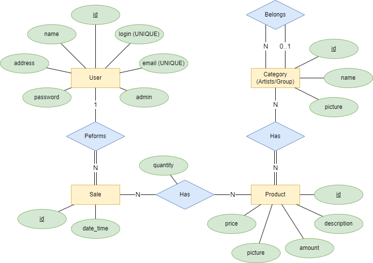
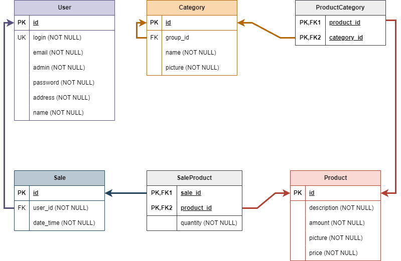
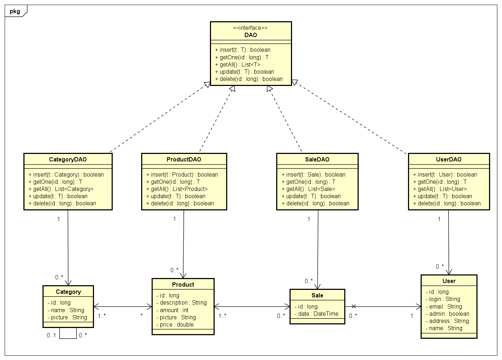

# StardustOrg :sparkles:

Bem-vindo ao repositório da StardustOrg, uma organização dedicada a abrigar os trabalhos desenvolvidos para a disciplina "Programação para Web I" do curso de Sistemas e Mídias Digitais da Universidade Federal do Ceará (UFC). Este repositório contém os projetos e atividades desenvolvidos por alunos ao longo do curso.

**Sumário de entregas: [Entrega 01 (29/09/2023)](https://github.com/StardustOrg/.github/edit/main/profile/README.md#entrega-01-29092023) • [Entrega 02 (23/10/2023)](https://github.com/StardustOrg/.github/edit/main/profile/README.md#entrega-02-23102023)  • [Entrega 03 (*in progress...*)]() • [Entrega Final (*to do*)]() •**

## Membros da Equipe :busts_in_silhouette:

| Nome             | Matrícula | Email                  |
|---------------------|-----------|------------------------|
| JOAO VICTOR BARROSO ALVES        | 509697    | joaovba2002@alu.ufc.br      |
| NICKOLAS GABRIEL LIMA RODRIGUES  | 509811    | nickolasgabriel@alu.ufc.br      |
| VLADIA HELEN FERREIRA FARIAS     | 511730    | vladiahelenff@gmail.com     |
| YANNA TORRES GONCALVES     | 507773    | torres.yanna03@gmail.com      |

Juntos, buscamos aplicar os conceitos e técnicas aprendidas para criar soluções web funcionais e utilizáveis.

## StardustCard :computer:

<div align="center">
   
</div>

<br>

O principal produto da organização StardustOrg é o e-commerce StardustCard, uma plataforma de vendas de Photocards de K-pop da mais alta qualidade. O StardustCard é uma janela para os colecionadores de photocards e fãs de K-pop, permitindo que estes adquiram Photocards autênticos sem necessidade de comprar os álbuns.
*A touch of Stardust*

### Tecnologias Utilizadas 🛠️

- **Prototipação:** Figma e Draw.io
- **Desenvolvimento Front-end:** HTML, CSS e JavaScript
- **Desenvolvimento Back-end:** Java (JSP e Servlet)
- **Banco de Dados:** PostgreSQL

### Entregas 📅

#### Entrega 01 (29/09/2023)

1. **Protótipo StardustCard** :memo:
   
   Descrição: Protótipo de alta fidelidade do e-commerce StardustCard, uma loja de photocards, para os perfis Cliente e Administrador.
   
   [Link para o Protótipo no Figma](https://www.figma.com/file/PJWhswW6SMbAIEF9cnT8bz/Stardust-%7C-Prot%C3%B3tipo?type=design&node-id=0%3A1&mode=design&t=noJvPYJ8AvP8BBOh-1)

2. **Modelo Banco de Dados** :card_index_dividers:
   
   Descrição: Modelagem do Banco de Dados Relacional (Modelo Entidade-Relacionamento e Modelo Relacional).

   - **MER:**
     
     

   - **Modelo Relacional:**
     
     
      
   Para a instanciação do banco, segue os seguinte script:
   * [Script de criação](https://github.com/StardustOrg/Database/blob/main/stardust_db_schema.sql)

4. **Front-end** :art:
   
   Descrição: Primeira versão do front-end do e-commerce em HTML, CSS e JavaScript.

   - [Repositório Front-end Cliente](https://github.com/StardustOrg/BasicHTML_Client)
   - [Repositório Front-end Admin](https://github.com/StardustOrg/BasicHTML_Admin)

#### Entrega 02 (23/10/2023)

1. **Diagrama de Classes** :pick:

   Para guiar o desenvolvimento do sistema, criamos um pequeno diagrama de classes relacionado a camada Model.

   
   
2. **Camada 'Model' (MVC)** :clipboard:

   Com base no diagrama de classes do item anterior, desenvolvemos toda a camada modelo que pode ser encontrada dentro do pacote `model` do [projeto](https://github.com/StardustOrg/StardustCard-Ecommerce/tree/main/src/java/model)

3. **Funcionalidades**

     - **Cadastrar Novo Cliente**:
       
          Para a realização dessa função partimos da criação de um formulário de cadastro que passa como `action` o caminho `/Register`:
         ```jsp
         <form method="POST" action="${pageContext.request.contextPath}/Register" onsubmit="return validateRegisterForm()">
           <h2>Create account</h2>
           <label>Your Name:</label>
           <input type="text" name="name" id="name" placeholder="First and last name" required>
           <label>Address:</label>
           <input type="text" name="address" id="address" placeholder="Your address" required>
           <label>Email:</label>
           <input type="email" name="email" id="email" placeholder="Your email" required>
           <label>Login:</label>
           <input type="text" name="login" id="login" placeholder="At least 6 characters" required>
           <label>Password:</label>
           <input type="password" name="password" id="password" placeholder="At least 6 characters" required>
           <label>Confirm Password:</label>
           <input type="password" name="confirm-password" id="confirm-password" placeholder="Repeat your password"
                  required>
           <button>Register</button>
         </form>
         ```
         Esta action aciona a `RegisterServlet` que em seu método POST recupera os dados de cadastro e utiliza o `UserDAO` para inserir os dados no banco, se o cadastro der certo ele redireciona para a Tela de Login, se não deu certo ele dá um aviso de erro e permanece na tela de Register:
         ```java
            protected void doPost(HttpServletRequest request, HttpServletResponse response) throws ServletException, IOException {
              String login = request.getParameter("login");
              String email = request.getParameter("email");
              boolean admin = Boolean.parseBoolean(request.getParameter("admin"));
              String password = request.getParameter("password");
              String address = request.getParameter("address");
              String name = request.getParameter("name");
            
              User user = new User(login, password, email, admin, address, name);
              UserDAO userDAO = new UserDAO();
              boolean cadastrado = userDAO.insert(user);
            
              if (cadastrado) {
                  response.sendRedirect("Login");
              } else {
                  String alertMessage = "Registration failed. Please try again.";
                  String redirectScript = "<script>alert('" + alertMessage + "'); window.location.href = 'Register';</script>";
                  response.getWriter().write(redirectScript);
              }
            }
         ```

     - **Autenticar acesso (Login):**
      
         Para a realização dessa função partimos da criação de um formulário de login que passa como `action` o caminho `/Login`:
         ```jsp
          <form method="POST" action="${pageContext.request.contextPath}/Login" onsubmit="return validateLoginForm()">
              <h2>Sign in</h2>
              <label>Login:</label>
              <input type="text" name="login" id="login" placeholder="Login" required>
              <label>Password:</label>
              <input type="password" name="password" id="password" placeholder="Password" required>
              <a class="text_link">Forgot password?</a>
              <button>Sign In</button>
          </form>
         ```
         Este action aciona a `LoginServlet` que posui um método POST que recupera os dados de login e usa o `UserDAO` para verificar no banco se aqueles dados existem. Se existirem a Servlet cria variáveis de sessão para armazenar dados do usuário. Após isso, a servlet redireciona o usuário para a tela correspondente a seu tipo de usuário, caso ele seja administrador leva para a tela de `Admin`, caso contrário, para a tela de `Home`.
       ```java
          protected void doPost(HttpServletRequest request, HttpServletResponse response)
               throws ServletException, IOException {
           String login = request.getParameter("login");
           String password = request.getParameter("password");
         
           UserDAO userDAO = new UserDAO();
           boolean success = userDAO.validateAccess(login, password);
           response.setContentType("text/html;charset=UTF-8");
           if (success) {
               User myUser = userDAO.getOne(login);    
               /**
                * Cria uma sessão de usuário com Login, Nome se o usuário é Admin
                */
               HttpSession session = request.getSession();
               session.setAttribute("login", myUser.getLogin());
               session.setAttribute("name", myUser.getName());
               session.setAttribute("isAdmin", myUser.isAdmin());
         
               if (myUser.isAdmin()) {
                   response.sendRedirect("Admin");
               } else {
                   response.sendRedirect("Home");
               }
           } else {
               String alertMessage = "Login failed. Wrong Login/Password. Please try again.";
               String redirectScript = "<script>alert('" + alertMessage + "');  window.location.href = 'Login';</script>";
               response.getWriter().write(redirectScript);
           }
         }
       ```
         Por fim, protegemos as rotas das telas de Admin, uma vez que essas telas não podem ser acessadas a não ser que o usuário esteja autenticado como administrador, por meio de um Servlet que redireciona para a página, porém antes de redirecionar verifica a Sessão para ver se o usuário autenticado é um administrador:
       ```java
         @Override
         protected void doGet(HttpServletRequest request, HttpServletResponse response)
               throws ServletException, IOException {
           RequestDispatcher dispatcher = request.getRequestDispatcher("/admin/index.jsp");
           dispatcher.forward(request, response);
         }
       ``` 

4. **Remodelagem do Banco de Dados** :floppy_disk:

   Por fim, houve uma atualização no esquema de algumas tabelas, principalmente a tabela de *Categoria* (onde foi adicionado um novo campo, para guardar outra imagem).

   O novo script de instanciação do banco pode ser encontrado no seguinte arquivo: [Script de criação](https://github.com/StardustOrg/Database/blob/main/stardust_db_schema.sql)

   :exclamation: Recomendamos que o banco seja instanciado com o nome "stardust_db". Caso deseje usar outro nome, mude a referência na classe `Config`, no pacote `config` do código.

   :exclamation: No novo script de criação já vem incluido um usuário *admin* com as seguintes credenciais de acesso:

      - **login:** admin01
      - **senha:** 123456

#### Entrega 03 (*in progress...*)

#### Entrega Final (*to do*)
